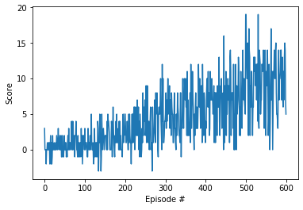

# Report on the Navigation project


## Learning Algorithm
	
The used learning agent is based on the Deep Q-Learning with fixed Target algorithm, illustrated on LunarLander environment.

Main adjustements were done on communicating between agent and Unity environment:
```sh
action = (int)(agent.act(state, eps))
#next_state, reward, done, _ = env.step(action) - was used in LunarLander
env_info = env.step(action)[brain_name]
next_state = env_info.vector_observations[0]   # get the next state
reward = env_info.rewards[0]                   # get the reward
done = env_info.local_done[0]                  # get the done
```

## Progress and hyperparameters estimation

### First Run

First attempt was done with following model architecture:

```sh
input (37) -> ReLU -> fully connected layer (fcl) (100) -> ReLU -> fcl (80) -> output (4)
```

Hyperparameters were following:
```sh
BUFFER_SIZE = int(1e5)  # replay buffer size
BATCH_SIZE = 10         # minibatch size
GAMMA = 0.99            # discount factor
TAU = 1e-3              # for soft update of target parameters
LR = 0.01               # learning rate 
UPDATE_EVERY = 4        # how often to update the network
```

The resulted learning progress was frustrating:
```sh
Episode 100	Average Score: -0.01
Episode 200	Average Score: 0.172
Episode 300	Average Score: -0.02
Episode 400	Average Score: -0.20
Episode 500	Average Score: -0.01
```

I interrupted the kernel, so there is no plot, but results are obvious anyway.

### Second Run

The second attempt was done with following model architecture:

```sh
input (37) -> ReLU -> fully connected layer (fcl) (64) -> ReLU -> fcl (64) -> ReLU -> fcl (64) -> output (4)
```

Hyperparameters were following:
```sh
BUFFER_SIZE = int(1e5)  # replay buffer size
BATCH_SIZE = 10         # minibatch size
GAMMA = 0.99            # discount factor
TAU = 1e-3              # for soft update of target parameters
LR = 0.001              # learning rate 
UPDATE_EVERY = 10       # how often to update the network
```

The resulted learning progress was frustrating:
```sh
Episode 100	Average Score: 0.58
Episode 200	Average Score: 1.43
Episode 300	Average Score: 3.31
Episode 400	Average Score: 5.30
Episode 500	Average Score: 6.95
Episode 600	Average Score: 9.49
```
Performance plot:<br/>


## Ideas for Future Work
	
 - Play further with hyperparameters
 - Improve the learning algorithm (include Duelling 
